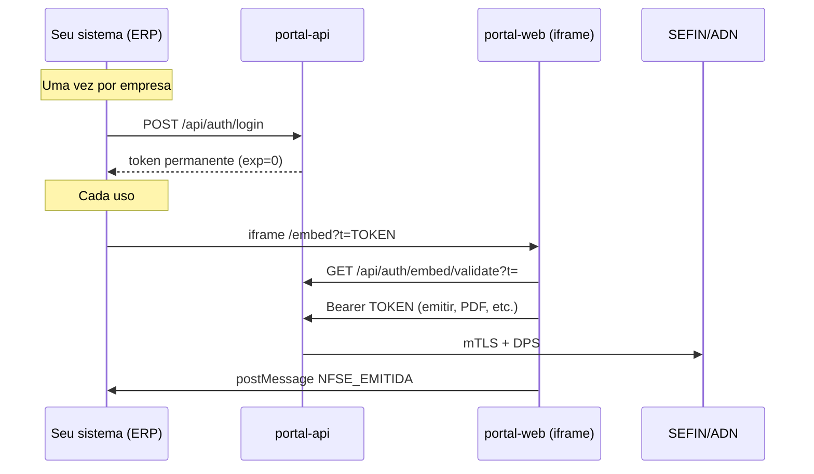

# Portal NFS-e (embed) — documentação

Portal web para **emitir**, **consultar** e **imprimir** NFS-e no padrão **nacional (SEFIN/ADN)**, usando certificado **A1 (.pfx)** e a biblioteca `io.github.t3wv:nfse` deste repositório.

---

## Índice

1. [Arquitetura](#1-arquitetura)
2. [Subir em homologação](#2-subir-em-homologação-passo-a-passo)
3. [Certificado digital](#3-certificado-digital)
4. [Município e ambiente](#4-município-e-ambiente)
5. [Interface (wizard)](#5-interface-wizard)
6. [Lista LC 116](#6-lista-de-serviços-lc-116)
7. [NBS](#7-nbs-nomenclatura-brasileira-de-serviços)
8. [Emissão e impressão](#8-emissão-consulta-e-impressão)
9. [API REST do portal](#9-api-rest-do-portal)
10. [Integração embed — guia completo](#10-integração-embed--guia-completo-para-outro-sistema)
11. [Variáveis de ambiente](#11-variáveis-de-ambiente)
12. [Problemas comuns](#12-problemas-comuns)

---

## 1. Arquitetura

| Componente | Pasta | Porta | Função |
|------------|-------|-------|--------|
| **portal-api** | `portal-api/` | 8080 | Spring Boot: certificado, emissão DPS, PDF/XML, LC 116 |
| **portal-web** | `portal-web/` | 3000 | Next.js: wizard embed + consulta |
| **lib nfse** | `src/main/java/...` | — | Integração SEFIN/ADN (homolog = produção restrita) |

Fluxo de emissão:

```
Navegador (embed) → portal-api → WSFacade → sefin.producaorestrita.nfse.gov.br (homolog)
                     ↑ mTLS com certificado A1
```

---

## 2. Subir em homologação (passo a passo)

### Pré-requisitos

- JDK **21**
- Node **18+** e `npm` no `portal-web`
- Certificado **e-CNPJ A1** em `.pfx` (o de testes/homologação que vocês já usam)
- Senha do PFX

### Opção A — script pronto (recomendado)

```bash
cd /home/aurelio/FONTES/SPRING/nfse2

export CERTIFICADO_PATH=/home/aurelio/FONTES/CERTIFICADOS/ClovisWerlang_safe1283.pfx
export CERTIFICADO_SENHA=safe1283
export MUNICIPIO_IBGE=4310009          # código IBGE do município do prestador (7 dígitos)
export PREFEITURA="Ibiruba/RS"
export NFSE_AMBIENTE=homologacao

chmod +x scripts/portal-homolog.sh
./scripts/portal-homolog.sh
```

O script chama `start-portal.sh`, que compila a lib, sobe API e Next.js e imprime a URL com token.

### Opção B — manual

```bash
mvn install -DskipTests
cd portal-api && mvn package -DskipTests
java -jar target/nfse-portal-api-0.1.0-SNAPSHOT.jar   # com as variáveis acima exportadas

cd ../portal-web && npm install && npm run dev
```

### Abrir o portal

1. Acesse a URL exibida no terminal, por exemplo:  
   `http://localhost:3000/embed?t=TOKEN`
2. Login da API (se precisar gerar token de novo):  
   **email** `admin@synki.demo` · **senha** `demo123`

```bash
curl -s -X POST http://localhost:8080/api/auth/login \
  -H 'Content-Type: application/json' \
  -d '{"email":"admin@synki.demo","senha":"demo123"}'
```

Use o campo `token` na query `?t=`.

### Trocar certificado (somente servidor)

A tela **não** pede PFX nem senha. O certificado vem da API (`DemoCertificadoLoader` + variáveis `CERTIFICADO_PATH` / `CERTIFICADO_SENHA`).

Para atualizar sem expor arquivo na UI:

```bash
export CERTIFICADO_PATH=/caminho/seu.pfx
export CERTIFICADO_SENHA=senha
chmod +x scripts/portal-upload-cert.sh
./scripts/portal-upload-cert.sh
```

Ou reinicie a API com as variáveis corretas (e banco sem certificado, se necessário).

---

## 3. Certificado digital

### Carregamento automático na subida

Se não existir certificado no banco, a API lê o PFX configurado em:

- `CERTIFICADO_PATH` (padrão em `application.yml`: `ClovisWerlang_safe1283.pfx`)
- `CERTIFICADO_SENHA`

Classe: `DemoCertificadoLoader`.

O **CNPJ do prestador** é extraído do subject do certificado e gravado na empresa (`CertificadoService` / `CertificadoLeituraService`).

### Requisitos para emitir

| Requisito | Motivo |
|-----------|--------|
| Certificado **e-CNPJ** A1 | Pessoa física (e-CPF) não habilita emissão como CNPJ |
| PFX válido e senha correta | mTLS na SEFIN |
| CNPJ do cert = prestador na DPS | Validação nacional |
| Município conveniado + parâmetros | Alíquota e regras no ADN |

A barra verde/amarela no topo do wizard mostra apenas dados de `GET /api/nfse/emissao/contexto` (ambiente, município, prestador do certificado no servidor).

### Cadeia SSL (truststore)

Na primeira chamada à SEFIN, a API gera `nfse-cacerts-{empresaId}.jks` em `/tmp` com os hosts de homologação/produção (ver README §3 da lib).

---

## 4. Município e ambiente

### Homologação vs produção

| `NFSE_AMBIENTE` / coluna `ambiente` | Lib `config.isTeste()` | Hosts SEFIN/ADN |
|-------------------------------------|------------------------|-----------------|
| `homologacao` | `true` | `*.producaorestrita.nfse.gov.br` |
| `producao` | `false` | `*.nfse.gov.br` |

**Notas em homologação não têm valor fiscal.**

### Ajustar município (IBGE)

O código IBGE de **7 dígitos** deve ser o município do **prestador** (emissor), alinhado ao convênio municipal:

```bash
export MUNICIPIO_IBGE=4216602    # exemplo: São José/SC
export PREFEITURA="Sao Jose/SC"
```

Reinicie a API ou use Flyway/SQL na tabela `configuracao_nfse` (empresa_id = 1).

Migração `V7__homologacao_padrao.sql` define ambiente **homologacao** para a empresa demo.

`DemoHomologConfigUpdater` aplica `MUNICIPIO_IBGE`, `PREFEITURA` e `NFSE_AMBIENTE` a cada subida.

### Conferir convênio

```bash
curl -s "http://localhost:8080/api/nfse/convenio/4310009" \
  -H "Authorization: Bearer SEU_TOKEN"
```

---

## 5. Interface (wizard)

Abas no embed: **Emitir** | **Consultar**.

### Wizard Emitir (4 passos)

1. **Cliente** — CPF/CNPJ (Brasil API + histórico local)
2. **Serviço** — busca na lista LC 116 completa
3. **Valor** — valor, Simples Nacional, ISS retido; alíquota consultada no ADN
4. **Revisão** — resumo e botão **Emitir NFS-e**

**Classificação fiscal do serviço** (passo Serviço): LC 116, **NBS** (920 códigos oficiais MDIC), CNAE e código tributário — autocomplete pesquisável; sugestão automática de NBS ao escolher o item LC 116.

Seção recolhida **Tributação e Classificação Fiscal**: retenções, RPS, IBS/CBS, etc.

Cor de marca: `#61AD3E`, fundo claro (estilo checkout enxuto).

---

## 6. Lista de serviços LC 116

| Aspecto | Detalhe |
|---------|---------|
| Fonte | [Lista LC 116 — gov.br](https://www.gov.br/nfse/pt-br/mei-e-demais-empresas/codigos-de-tributacao-nacional-nbs) |
| Armazenamento | `portal-api/src/main/resources/lc116-servicos.json` (**335** itens) |
| API | `GET /api/nfse/servicos?termo=&limite=400&grupo=` |
| Filtros `grupo` | `todos` (padrão), `agro`, `mecanico` |
| Formato código | `XX.XX.XX.000` (ex.: `01.07.01.000`) |

Na tela **Serviço**, use os chips **Agro** / **Mecânico** ou busque (ex.: `trator`, `agronomia`, `funilaria`). Com **Todos**, a lista completa aparece com agro e mecânico no topo.

A API federal **não** lista LC 116; só consulta alíquota **por código**. O catálogo fica no portal.

---

## 7. NBS (Nomenclatura Brasileira de Serviços)

| Aspecto | Detalhe |
|---------|---------|
| Fonte | [NBS 2.0 — MDIC](https://www.gov.br/mdic/pt-br/assuntos/sdic/comercio-e-servicos/nbs-nomenclatura-brasileira-de-servicos) (`nbs2-0.csv`) |
| Armazenamento | `portal-api/src/main/resources/nbs-servicos.json` (**920** subitens) |
| API | `GET /api/nfse/nbs?termo=&limite=40&lc116=` |
| Na DPS | Campo `cNBS` (9 dígitos, ex.: `114061100`) |
| UX | Bloco **Classificação fiscal do serviço** no passo Serviço; autocomplete; últimos usados no navegador; sugestão ao escolher LC 116 |

Exemplo na tela: `[ 1.1406.11.00 ] Desenvolvimento de software…`

Correlação LC 116 → NBS usa tabela simplificada (Anexo VIII); confira o código exato na [planilha oficial RTC](https://www.gov.br/nfse/pt-br/biblioteca/documentacao-tecnica/rtc/anexoviii-correlacaoitemnbsindopcclasstrib_ibscbs_v1-00-00.xlsx/view).

---

## 8. Emissão, consulta e impressão

### Emitir

1. Certificado OK (barra verde)
2. Preencher wizard → **Emitir NFS-e**
3. Sucesso: chave de **50 dígitos**

`POST /api/nfse/emitir` monta a DPS (`DpsMontadorService`) e chama `WSFacade.emitirNFSe`.

### Imprimir / baixar (DANFSe)

| Onde | Ação |
|------|------|
| Tela de sucesso | **Imprimir** (PDF inline + diálogo de impressão), **Baixar PDF**, **XML** |
| Consultar → chave | **Imprimir DANFSe**, **Baixar PDF**, **XML** |
| Consultar → tabela | Ícones impressora / download por nota |

| Endpoint | Uso |
|----------|-----|
| `GET /api/nfse/pdf/{chave}` | Download (`attachment`) |
| `GET /api/nfse/pdf/{chave}?inline=true` | Visualizar/imprimir no navegador |
| `GET /api/nfse/xml/{chave}` | XML da NFS-e |
| `GET /api/nfse/consulta/{chave}` | JSON da consulta SEFIN |

Implementação: `WSFacade.downloadNotaPdf` / `downloadNotaXml`.

**Pop-ups** devem estar liberados para **Imprimir**.

### Histórico

`GET /api/nfse/historico` — últimas ações (emissão/consulta) da empresa no portal.

---

## 9. API REST do portal

Todas as rotas abaixo (exceto login/validate) exigem header:

```
Authorization: Bearer TOKEN
```

### Auth

| Método | Rota | Descrição |
|--------|------|-----------|
| POST | `/api/auth/login` | `{ "email", "senha" }` → `{ "token" }` |
| GET | `/api/auth/embed/validate?t=` | Valida token embed |

### NFS-e

| Método | Rota | Descrição |
|--------|------|-----------|
| GET | `/api/nfse/emissao/contexto` | Prestador, município, ambiente, `podeEmitir` |
| GET | `/api/nfse/config` | Prefeitura, IBGE, ambiente |
| GET | `/api/nfse/servicos?termo=&limite=` | Busca LC 116 |
| GET | `/api/nfse/nbs?termo=&lc116=` | Busca / sugestão NBS |
| GET | `/api/nfse/aliquota?codigoMunicipio=&codigoServico=` | Alíquota ADN |
| GET | `/api/nfse/convenio/{ibge}` | Status convênio |
| POST | `/api/nfse/emitir` | Corpo `EmissaoCompletaRequest` |
| GET | `/api/nfse/consulta/{chave}` | Consulta por chave |
| GET | `/api/nfse/pdf/{chave}` | PDF DANFSe |
| GET | `/api/nfse/xml/{chave}` | XML |
| GET | `/api/nfse/historico` | Log de operações |

Health: `GET http://localhost:8080/actuator/health`

---

## 10. Integração embed — guia completo para outro sistema

Este capítulo descreve **como replicar o mesmo mecanismo** em qualquer ERP, SaaS ou backend: autenticação por token opaco, iframe do portal ou chamadas REST diretas à `portal-api`.

### Índice da seção 10

1. [Visão geral e arquitetura](#101-visão-geral-e-arquitetura)
2. [Modelo de dados (multiempresa)](#102-modelo-de-dados-multiempresa)
3. [Especificação do token (implementável)](#103-especificação-do-token-implementável)
4. [Obter o token (login)](#104-obter-o-token-login)
5. [Validar o token](#105-validar-o-token)
6. [Usar o token na API REST](#106-usar-o-token-na-api-rest)
7. [Integração via iframe (UI pronta)](#107-integração-via-iframe-ui-pronta)
8. [Integração sem iframe (só API)](#108-integração-sem-iframe-só-api)
9. [Gerar token no seu backend (mesmo algoritmo)](#109-gerar-token-no-seu-backend-mesmo-algoritmo)
10. [Protocolo postMessage (ERP ↔ iframe)](#1010-protocolo-postmessage-erp--iframe)
11. [Onboarding de uma nova empresa](#1011-onboarding-de-uma-nova-empresa)
12. [Deploy, CORS e variáveis](#1012-deploy-cors-e-variáveis)
13. [Segurança e revogação](#1013-segurança-e-revogação)
14. [Erros comuns e diagnóstico](#1014-erros-comuns-e-diagnóstico)

---

### 10.1 Visão geral e arquitetura

Três peças:

| Peça | URL típica | Função |
|------|------------|--------|
| **portal-api** | `https://api.seudominio.com.br` | Spring Boot: valida token, certificado A1, emite DPS na SEFIN |
| **portal-web** | `https://portal.seudominio.com.br` | Next.js: wizard embed (`/embed?t=TOKEN`) |
| **Seu sistema** | `https://erp.cliente.com.br` | Gera/guarda token, monta iframe ou chama API |



**Fluxo resumido**

1. No portal, cadastre **empresa** + **usuário** + **certificado** + **config NFS-e**.
2. Seu backend chama **login** e guarda o `token` (config por empresa).
3. Opção A: iframe com `?t=token`. Opção B: seu front chama a mesma API com `Authorization: Bearer`.
4. Após emitir, receba a **chave** via `postMessage` ou `POST /api/nfse/emitir`.

O token **não substitui** o certificado digital: ele só diz *qual empresa* está autenticada. A emissão exige **e-CNPJ A1** cadastrado para essa `empresaId`.

---

### 10.2 Modelo de dados (multiempresa)

Tabelas principais (`portal-api/src/main/resources/db/migration/`):

**`empresa`**

| Coluna | Tipo | Descrição |
|--------|------|-----------|
| `id` | BIGINT PK | Vai no token como `empresaId` |
| `nome` | VARCHAR | Razão social exibida |
| `cnpj` | VARCHAR(14) | Somente dígitos |
| `ativo` | BOOLEAN | `false` = bloquear uso |

**`usuario`**

| Coluna | Tipo | Descrição |
|--------|------|-----------|
| `id` | BIGINT PK | Vai no token como `usuarioId` |
| `empresa_id` | FK | Uma empresa por usuário de integração |
| `email` | VARCHAR UNIQUE | Login em `/api/auth/login` |
| `senha` | VARCHAR | BCrypt (não enviar ao iframe) |
| `ativo` | BOOLEAN | Revogação: desativar usuário |

Outras tabelas atreladas ao **`empresa_id` do token** (não ao usuário):

- `certificado` — PFX A1
- `configuracao_nfse` — município IBGE, ambiente (`homologacao` / `producao`)
- `nfse_log` — histórico de emissões/consultas

**Demo (desenvolvimento)**

| Campo | Valor |
|-------|-------|
| Email | `admin@synki.demo` |
| Senha | `demo123` |
| `empresaId` | `1` |
| `usuarioId` | `1` (após seed) |

---

### 10.3 Especificação do token (implementável)

Token **opaco**, não é JWT padrão. Não carrega e-mail, CPF ou senha.

#### Estrutura

```
texto_claro = empresaId + "|" + usuarioId + "|" + exp
assinatura  = Base64URL( HMAC-SHA256( texto_claro, NFSE_JWT_SECRET ) )
token       = Base64URL( texto_claro + "|" + assinatura )
```

| Campo | Tipo | Descrição |
|-------|------|-----------|
| `empresaId` | inteiro decimal | PK em `empresa.id` |
| `usuarioId` | inteiro decimal | PK em `usuario.id` |
| `exp` | inteiro decimal | `0` = **nunca expira**; `>0` = epoch Unix (segundos UTC) |
| `assinatura` | string Base64 URL | Sem padding `=` |

**Codificação Base64 URL:** alfabeto `A-Za-z0-9-_`, sem `+`, `/`, nem padding.

#### Validação (regras)

1. Decodificar Base64 URL → string UTF-8.
2. `split("|")` deve ter **exatamente 4** partes.
3. Recalcular HMAC do payload `empresaId|usuarioId|exp`.
4. Comparar com a 4ª parte (comparação exata de string).
5. Se `exp != 0` e `agora_epoch > exp` → rejeitar (“expirado”).
6. Carregar `empresa`/`usuario` ativos no banco (recomendado em produção; hoje o filtro só valida assinatura).

#### Expiração (`NFSE_JWT_EXP_MIN`)

| Config API | `exp` no token | Uso |
|------------|----------------|-----|
| `0` (padrão) | `0` | Token **permanente** — uma URL de iframe por empresa |
| `480` | `now + 480*60` | Sessão de 8 horas |

Implementação de referência: `portal-api/.../EmbedTokenService.java`.

#### Exemplo manual

Payload claro: `1|2|0` (empresa 1, usuário 2, permanente).

Com secret de dev `change-me-in-production-use-long-random-string`, gere o token com o script da [seção 10.9](#109-gerar-token-no-seu-backend-mesmo-algoritmo) ou via login.

---

### 10.4 Obter o token (login)

Único endpoint público que **cria** token hoje (sem expor o secret no ERP).

```http
POST /api/auth/login
Content-Type: application/json

{
  "email": "integracao@cliente.com.br",
  "senha": "senha-forte"
}
```

**Resposta 200**

```json
{
  "token": "MSwyfDBxYzFi...",
  "empresaId": 1,
  "usuarioId": 2,
  "nome": "Integração NFS-e"
}
```

**Erros**

| HTTP | Corpo | Causa |
|------|-------|-------|
| 400 | `{"erro":"Credenciais invalidas"}` | E-mail/senha incorretos ou usuário inativo |

**cURL**

```bash
API=https://api.seudominio.com.br
curl -s -X POST "$API/api/auth/login" \
  -H 'Content-Type: application/json' \
  -d '{"email":"admin@synki.demo","senha":"demo123"}'
```

**O que fazer no seu sistema**

1. Chamar login **uma vez** na implantação da empresa (ou quando rotacionar credencial).
2. Persistir `token`, `empresaId`, `usuarioId` na tabela de configuração do tenant.
3. Usar o **mesmo** `token` na URL do iframe e nas chamadas API (com `NFSE_JWT_EXP_MIN=0`).

Não é necessário login a cada abertura de tela, desde que o token seja permanente.

---

### 10.5 Validar o token

Antes de exibir o iframe (opcional mas recomendado):

```http
GET /api/auth/embed/validate?t=TOKEN_URL_ENCODED
```

Sem header `Authorization`.

**Resposta 200**

```json
{
  "empresaId": 1,
  "usuarioId": 2,
  "valido": true
}
```

**Falha:** HTTP 400, `{"erro":"Token invalido ou expirado"}` (ou mensagem similar).

O **portal-web** faz isso em `useEmbedToken` → se falhar, mostra “Token inválido”.

---

### 10.6 Usar o token na API REST

Todas as rotas `/api/nfse/**` (exceto catálogos públicos) exigem:

```http
Authorization: Bearer TOKEN
Content-Type: application/json
```

O filtro `EmbedAuthFilter` extrai o Bearer, valida o token e preenche o contexto com `EmbedSession(empresaId, usuarioId)`.

#### Rotas que **não** exigem Bearer

| Método | Rota | Motivo |
|--------|------|--------|
| POST | `/api/auth/login` | Obter token |
| GET | `/api/auth/embed/validate` | Validar token na URL |
| GET | `/api/nfse/servicos` | Catálogo LC 116 |
| GET | `/api/nfse/nbs` | Catálogo NBS |
| GET | `/api/nfse/cnae` | Catálogo CNAE IBGE |
| GET | `/actuator/health` | Health check |

#### Rotas principais (exigem Bearer)

| Método | Rota | Descrição |
|--------|------|-----------|
| GET | `/api/nfse/emissao/contexto` | Prestador, certificado, `podeEmitir`, ambiente |
| GET | `/api/nfse/config` | Prefeitura, IBGE, ambiente |
| POST | `/api/nfse/emitir` | Corpo JSON `EmissaoCompletaRequest` |
| GET | `/api/nfse/consulta/{chave}` | Consulta SEFIN (50 dígitos) |
| GET | `/api/nfse/pdf/{chave}` | PDF DANFSe (`?inline=true` para visualizar) |
| GET | `/api/nfse/xml/{chave}` | XML da nota |
| GET | `/api/nfse/historico` | Últimas 50 operações da empresa |

#### Formato de erro padrão

```json
{ "erro": "mensagem legível" }
```

| HTTP | Situação |
|------|----------|
| 400 | Validação / argumento inválido |
| 401/403 | Sem Bearer ou token inválido (Spring Security) |
| 422 | Estado inválido (ex.: sem certificado) |
| 500 | Erro SEFIN ou interno |

#### Exemplo: contexto antes de emitir

```bash
TOKEN="..."
curl -s "$API/api/nfse/emissao/contexto" \
  -H "Authorization: Bearer $TOKEN"
```

Campos úteis:

| Campo | Significado |
|-------|-------------|
| `podeEmitir` | `true` se certificado e-CNPJ OK |
| `certificadoCadastrado` | Existe PFX para a empresa |
| `prestadorDocumento` | CNPJ do certificado |
| `codigoMunicipioIbge` | 7 dígitos |
| `ambiente` | `homologacao` ou `producao` |
| `aviso` | Mensagem se não puder emitir |

#### Exemplo: emitir (seu backend, sem iframe)

```bash
curl -s -X POST "$API/api/nfse/emitir" \
  -H "Authorization: Bearer $TOKEN" \
  -H 'Content-Type: application/json' \
  -d @payload-emissao.json
```

**Resposta 200**

```json
{
  "sucesso": true,
  "chaveAcesso": "4310009...50 dígitos...",
  "idDps": "...",
  "processadoEm": "2026-05-23T12:00:00"
}
```

O schema do body está em `portal-api/.../EmissaoCompletaRequest.java` e espelhado no front em `portal-web/src/types/emissao-form.ts` (`formParaPayload`).

---

### 10.7 Integração via iframe (UI pronta)

Use quando quiser a tela de emissão/consulta **sem desenvolver UI** de NFS-e.

#### URL

```
https://portal.seudominio.com.br/embed?t=TOKEN
```

| Parâmetro | Obrigatório | Descrição |
|-----------|-------------|-----------|
| `t` | Sim | Token opaco (URL-encode se tiver caracteres especiais) |

Rotas internas do embed:

| Aba | Conteúdo |
|-----|----------|
| Emitir | Wizard Cliente → Serviço → Valor → Revisão |
| Consultar | Busca por chave, PDF, XML |

#### HTML mínimo

```html
<!DOCTYPE html>
<html lang="pt-BR">
<head>
  <meta charset="utf-8" />
  <title>NFS-e</title>
  <style>
    #nfse-frame { width: 100%; min-height: 800px; border: 0; }
  </style>
</head>
<body>
  <iframe
    id="nfse-frame"
    title="Emissão NFS-e"
    src="https://portal.seudominio.com.br/embed?t=COLE_SEU_TOKEN_AQUI"
  ></iframe>
  <script src="/js/nfse-embed-listener.js"></script>
</body>
</html>
```

#### Configuração do front (portal-web)

Arquivo `portal-web/.env.local` (produção: variáveis do build):

```env
NEXT_PUBLIC_API_URL=https://api.seudominio.com.br
```

O iframe **só** envia o token para a API configurada nessa URL.

#### Checklist iframe

- [ ] HTTPS no ERP e no portal
- [ ] Token permanente salvo por tenant (`empresaId`)
- [ ] `CORS_ORIGINS` na API inclui a origem do portal (`https://portal...`)
- [ ] Listener `postMessage` instalado no ERP (seção 10.10)
- [ ] Pop-ups permitidos se usar “Imprimir PDF”

---

### 10.8 Integração sem iframe (só API)

Mesmo token, **sem** portal-web:

1. `POST /api/auth/login` → guardar token.
2. `GET /api/nfse/emissao/contexto` → verificar `podeEmitir`.
3. Montar JSON de emissão (seu código ou copiar estrutura do wizard).
4. `POST /api/nfse/emitir`.
5. `GET /api/nfse/pdf/{chave}` para arquivar DANFSe.

Catálogos LC 116 / NBS / CNAE são públicos (sem Bearer) para montar autocomplete no **seu** front.

---

### 10.9 Gerar token no seu backend (mesmo algoritmo)

Se o seu sistema **já conhece** `empresaId`, `usuarioId` e o **mesmo** `NFSE_JWT_SECRET` da API, pode gerar o token **sem** chamar login (útil para provisionamento automático).

**Requisitos:** secret idêntico ao da `portal-api`; IDs existentes no banco.

#### Python 3

```python
import base64, hmac, hashlib, time

def criar_token_embed(empresa_id: int, usuario_id: int, secret: str, exp_minutos: int = 0) -> str:
    exp = 0 if exp_minutos <= 0 else int(time.time()) + exp_minutos * 60
    payload = f"{empresa_id}|{usuario_id}|{exp}"
    sig = base64.urlsafe_b64encode(
        hmac.new(secret.encode(), payload.encode(), hashlib.sha256).digest()
    ).decode().rstrip("=")
    raw = f"{payload}|{sig}"
    return base64.urlsafe_b64encode(raw.encode()).decode().rstrip("=")

# Exemplo permanente
token = criar_token_embed(1, 2, "change-me-in-production-use-long-random-string")
print(token)
```

#### Java (mesma lógica da API)

```java
Mac mac = Mac.getInstance("HmacSHA256");
mac.init(new SecretKeySpec(secret.getBytes(StandardCharsets.UTF_8), "HmacSHA256"));
String payload = empresaId + "|" + usuarioId + "|" + 0;
String sig = Base64.getUrlEncoder().withoutPadding()
    .encodeToString(mac.doFinal(payload.getBytes(StandardCharsets.UTF_8)));
String token = Base64.getUrlEncoder().withoutPadding()
    .encodeToString((payload + "|" + sig).getBytes(StandardCharsets.UTF_8));
```

#### Node.js

```javascript
const crypto = require("crypto");

function criarToken(empresaId, usuarioId, secret, expMin = 0) {
  const exp = expMin <= 0 ? 0 : Math.floor(Date.now() / 1000) + expMin * 60;
  const payload = `${empresaId}|${usuarioId}|${exp}`;
  const sig = crypto.createHmac("sha256", secret).update(payload).digest("base64url");
  return Buffer.from(`${payload}|${sig}`, "utf8").toString("base64url");
}
```

**Validar** o token gerado:

```bash
curl -s "https://api.seudominio.com.br/api/auth/embed/validate?t=SEU_TOKEN"
```

---

### 10.10 Protocolo postMessage (ERP ↔ iframe)

O iframe notifica a janela pai (`window.parent`) quando algo importante acontece.

#### Formato da mensagem

Todas as mensagens são objetos JSON com:

| Campo | Tipo | Sempre |
|-------|------|--------|
| `source` | string | `"synki-nfse"` |
| `type` | string | Ver tabela abaixo |

Campos adicionais conforme o tipo.

#### Tipos de evento

| `type` | Campos | Quando |
|--------|--------|--------|
| `NFSE_EMITIDA` | `chave` (string, 50 dígitos) | Emissão OK no wizard |
| `ERRO_EMISSAO` | `mensagem` (string) | Falha na emissão |
| `NFSE_CANCELADA` | `chave` | Reservado (cancelamento futuro) |

Implementação no portal: `portal-web/src/lib/postMessage.ts`.

#### Listener completo no ERP (recomendado)

```javascript
// nfse-embed-listener.js — inclua na página que contém o iframe

const PORTAL_ORIGIN = "https://portal.seudominio.com.br"; // origem exata do iframe

window.addEventListener("message", (event) => {
  // 1) Segurança: só aceitar do portal
  if (event.origin !== PORTAL_ORIGIN) return;

  const data = event.data;
  if (!data || data.source !== "synki-nfse") return;

  switch (data.type) {
    case "NFSE_EMITIDA":
      // Gravar chave no seu banco, vincular ao pedido/OS, etc.
      console.log("NFS-e emitida:", data.chave);
      // Exemplo: fetch('/api/minha-app/nfse/callback', { method:'POST', body: JSON.stringify(data) })
      break;

    case "ERRO_EMISSAO":
      console.error("Erro NFS-e:", data.mensagem);
      break;

    case "NFSE_CANCELADA":
      console.log("NFS-e cancelada:", data.chave);
      break;

    default:
      break;
  }
});
```

**Importante:** hoje o portal envia com `targetOrigin "*"` no `postMessage`. No ERP, **sempre** valide `event.origin`. Em versão futura o portal pode restringir a origem do ERP via configuração.

#### Montar iframe dinamicamente (SPA)

```javascript
function abrirNfse(token) {
  const url = new URL("https://portal.seudominio.com.br/embed");
  url.searchParams.set("t", token);
  document.getElementById("nfse-frame").src = url.toString();
}
```

---

### 10.11 Onboarding de uma nova empresa

Checklist para integrar um **novo cliente** no mesmo mecanismo:

| # | Ação | Onde |
|---|------|------|
| 1 | Inserir registro em `empresa` (CNPJ, nome) | SQL / painel admin / script |
| 2 | Criar `usuario` com `empresa_id`, e-mail e senha BCrypt | `DemoDataInitializer` é exemplo em dev |
| 3 | Inserir `configuracao_nfse` (IBGE 7 dígitos, prefeitura, ambiente) | Flyway / SQL |
| 4 | Cadastrar certificado A1 (`.pfx`) | `CERTIFICADO_PATH` na subida ou upload futuro |
| 5 | `POST /api/auth/login` com usuário da empresa | Seu backend |
| 6 | Salvar `token` + `empresaId` na config do tenant | Seu banco |
| 7 | Testar `GET /api/nfse/emissao/contexto` → `podeEmitir: true` | curl |
| 8 | Testar iframe ou `POST /api/nfse/emitir` em homologação | Portal |
| 9 | Configurar listener `postMessage` no ERP | Front do cliente |
| 10 | Produção: `NFSE_AMBIENTE=producao` + certificado de produção | API |

Homologação SEFIN = ambiente `homologacao` (produção restrita ADN).

---

### 10.12 Deploy, CORS e variáveis

#### portal-api (obrigatório)

| Variável | Exemplo | Descrição |
|----------|---------|-----------|
| `NFSE_JWT_SECRET` | string longa aleatória | **Mesmo** secret se gerar token fora da API |
| `NFSE_JWT_EXP_MIN` | `0` | Token permanente para iframe |
| `CORS_ORIGINS` | `https://portal.seudominio.com.br` | Origens do browser (portal-web). Várias: separar por vírgula |
| `CERTIFICADO_PATH` / `CERTIFICADO_SENHA` | caminho `.pfx` | Certificado da empresa (demo) |
| `MUNICIPIO_IBGE` | `4310009` | 7 dígitos |
| `NFSE_AMBIENTE` | `homologacao` | ou `producao` |
| `PORT` | `8080` | Porta HTTP |

#### portal-web

| Variável | Exemplo |
|----------|---------|
| `NEXT_PUBLIC_API_URL` | `https://api.seudominio.com.br` |

#### CORS

O browser do **portal-web** chama a **portal-api**. A origem permitida é a do **site do portal** (onde o iframe é servido), não necessariamente a do ERP.

Se o **seu ERP** chamar a API diretamente via JavaScript (sem iframe), inclua também a origem do ERP em `CORS_ORIGINS`:

```bash
CORS_ORIGINS=https://portal.seudominio.com.br,https://erp.cliente.com.br
```

Chamadas **server-to-server** (Java, PHP, etc. no backend do ERP) **não** passam por CORS.

---

### 10.13 Segurança e revogação

| Risco | Mitigação |
|-------|-----------|
| Vazamento do token na URL | HTTPS; não logar query string em proxies; preferir iframe em página autenticada do ERP |
| Forjar token | Proteger `NFSE_JWT_SECRET`; nunca no front do ERP |
| Token permanente roubado | Rotacionar secret (invalida todos); desativar `usuario.ativo` |
| Empresa errada | Token amarra `empresaId`; certificado e NFS-e são isolados por empresa |
| CORS aberto | Listar só origens conhecidas |

**Revogar acesso**

1. `UPDATE usuario SET ativo = false WHERE id = ?` — login falha; token antigo ainda passa na assinatura até você validar `ativo` no filtro (melhoria futura).
2. Trocar `NFSE_JWT_SECRET` — invalida **todos** os tokens; todos os clientes precisam de novo login.

**Auditoria:** `nfse_log` registra emissões/consultas por `empresa_id`.

---

### 10.14 Erros comuns e diagnóstico

| Sintoma | Causa provável | Ação |
|---------|----------------|------|
| iframe “Token inválido” | Token mal copiado, secret diferente, ou `exp` passado | `GET /embed/validate?t=`; gerar novo login |
| API 403 sem mensagem | Header sem `Bearer` ou token inválido | Conferir `Authorization: Bearer ...` |
| `podeEmitir: false` | Sem certificado ou e-CPF | Cadastrar e-CNPJ A1 |
| CORS no browser | Origem do portal não está em `CORS_ORIGINS` | Ajustar env e reiniciar API |
| postMessage não chega | Origem errada no `if (event.origin)` | Usar origem exata do portal |
| Emissão OK mas ERP não sabe | Listener não registrado | Seção 10.10 |
| Token “expirado” com `exp=0` | Bug ou token antigo com exp futuro | Novo login com `NFSE_JWT_EXP_MIN=0` |

#### Teste rápido de ponta a ponta

```bash
API=http://localhost:8080
TOKEN=$(curl -s -X POST "$API/api/auth/login" \
  -H 'Content-Type: application/json' \
  -d '{"email":"admin@synki.demo","senha":"demo123"}' | jq -r .token)

curl -s "$API/api/auth/embed/validate?t=$TOKEN" | jq .
curl -s "$API/api/nfse/emissao/contexto" -H "Authorization: Bearer $TOKEN" | jq .
echo "iframe: http://localhost:3000/embed?t=$TOKEN"
```

---

### Referência rápida (cola na parede)

```
LOGIN:    POST /api/auth/login  →  token
VALIDAR:  GET  /api/auth/embed/validate?t=
API:      Header Authorization: Bearer {token}
IFRAME:   {PORTAL_URL}/embed?t={token}
EVENTOS:  window.message → source=synki-nfse, type=NFSE_EMITIDA|ERRO_EMISSAO
PERMANENTE: NFSE_JWT_EXP_MIN=0  →  exp=0 no payload
```

---

## 11. Variáveis de ambiente

Ver `portal-api/.env.example`.

| Variável | Descrição |
|----------|-----------|
| `CERTIFICADO_PATH` | Caminho do `.pfx` para carga inicial |
| `CERTIFICADO_SENHA` | Senha do PFX |
| `NFSE_AMBIENTE` | `homologacao` ou `producao` |
| `MUNICIPIO_IBGE` | 7 dígitos IBGE do prestador |
| `PREFEITURA` | Nome exibido na UI |
| `NFSE_JWT_SECRET` | Assinatura HMAC do token embed |
| `NFSE_JWT_EXP_MIN` | `0` = token permanente (iframe). `>0` = minutos até expirar |
| `PORT` | Porta API (8080) |
| `CORS_ORIGINS` | Origem do Next (3000) |

Frontend: `portal-web/.env.local` → `NEXT_PUBLIC_API_URL=http://localhost:8080`

---

## 12. Problemas comuns

| Sintoma | O que verificar |
|---------|-----------------|
| Botão Emitir desabilitado | Certificado ausente, e-CPF em vez de e-CNPJ, ou aviso na barra superior |
| Erro SSL / handshake | Apague `/tmp/nfse-cacerts-1.jks` e tente de novo (regenera cadeia) |
| Alíquota não encontrada | Código de serviço ou IBGE incorretos; município sem parametrização no ADN |
| Emissão rejeitada pela SEFIN | Tomador/serviço/valores; CNPJ prestador ≠ certificado; ambiente DPS ≠ homolog |
| PDF 404 / erro | Chave inválida, nota ainda não disponível, ou cert sem permissão na nota |
| Imprimir não abre | Pop-up bloqueado; use **Baixar PDF** |
| Certificado não carrega na subida | Arquivo inexistente em `CERTIFICADO_PATH`; use upload manual |

### Resetar banco H2 (dev)

```bash
rm -f portal-api/data/nfse-portal.*
# Subir API de novo — Flyway recria tabelas e seed
```

---

## Referências

- Biblioteca e endpoints nacionais: [README.md](README.md)
- Manual ADN/SEFIN: [gov.br/nfse](https://www.gov.br/nfse/pt-br/biblioteca/documentacao-tecnica)
